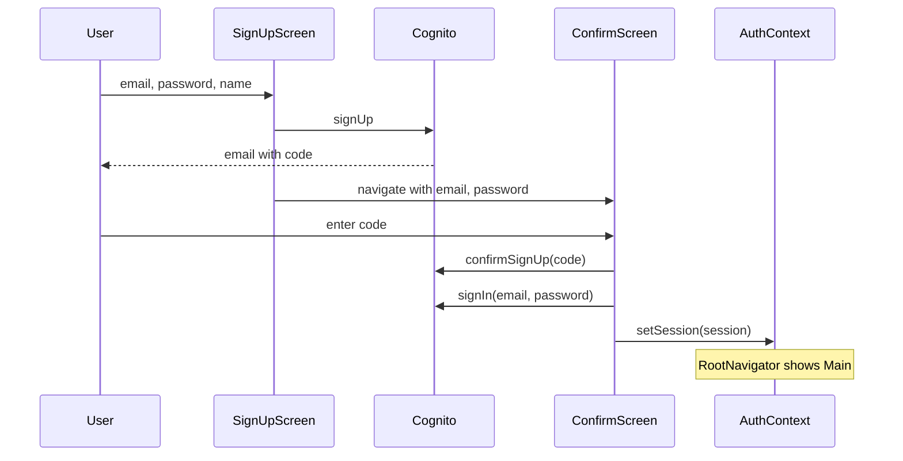

# Confirmation Screen for Sign-Up Flow

## Current gap

- [apps/mobile/src/screens/SignUpScreen.tsx](apps/mobile/src/screens/SignUpScreen.tsx) calls `auth.signUp()`; on success it shows an Alert and navigates to **Sign In**. There is no screen to enter the code Cognito sends to the user's email.
- [apps/mobile/src/services/auth.ts](apps/mobile/src/services/auth.ts) has no `confirmSignUp()` (or resend) — only `signUp`, `signIn`, `getSession`, `signOut`.

## Target flow

## 1. Auth service — confirm and optional resend

**File:** [apps/mobile/src/services/auth.ts](apps/mobile/src/services/auth.ts)

- **Add `confirmSignUp(email: string, code: string): Promise<void>**`
  - Create `CognitoUser` with `{ Username: email, Pool: pool }` (same pattern as `signIn`).
  - Call `cognitoUser.confirmRegistration(code, false, callback)`; wrap in a Promise (resolve on success, reject on err).
- **Optional:** Add `resendConfirmationCode(email: string): Promise<void>` using `cognitoUser.resendConfirmationCode(callback)` for a "Resend code" button.

No new imports beyond existing `CognitoUser` and `pool`.

## 2. New screen — ConfirmSignUpScreen

**New file:** `apps/mobile/src/screens/ConfirmSignUpScreen.tsx`

- **Route params:** `email: string`, `password: string` (so we can sign in after confirming).
- **UI:** Title (e.g. "Confirm your email"), short message ("We sent a code to …"), single `TextInput` for the 6-digit code, primary button "Confirm", optional "Resend code" link. Reuse layout/patterns from [SignInScreen.tsx](apps/mobile/src/screens/SignInScreen.tsx) (KeyboardAvoidingView, styles).
- **On submit:**
  1. `auth.confirmSignUp(email, code)`.
  2. On success: `auth.signIn(email, password)` then `setSession(session)` from `useAuth()`.
  3. No explicit navigation to Main — `setSession` causes [RootNavigator](apps/mobile/src/navigation/RootNavigator.tsx) to show Main.
- Handle errors (invalid/expired code, network) with `Alert.alert`.
- Loading state while confirming/signing in.

## 3. Navigation — new route and stack screen

**File:** [apps/mobile/src/navigation/types.ts](apps/mobile/src/navigation/types.ts)

- In `AuthStackParamList`, add: `ConfirmSignUp: { email: string; password: string };`

**File:** [apps/mobile/src/navigation/AuthStack.tsx](apps/mobile/src/navigation/AuthStack.tsx)

- Import `ConfirmSignUpScreen`.
- Add: `<Stack.Screen name="ConfirmSignUp" component={ConfirmSignUpScreen} options={{ title: 'Confirm your email' }} />`

## 4. SignUpScreen — go to Confirmation instead of Sign In

**File:** [apps/mobile/src/screens/SignUpScreen.tsx](apps/mobile/src/screens/SignUpScreen.tsx)

- On successful `auth.signUp(...)`:
  - Remove the Alert that says "Confirm your account … then sign in" and navigates to Sign In.
  - Navigate to `ConfirmSignUp` with params `{ email: email.trim(), password }`.
- Optional: show a short in-screen message or Alert like "Check your email for a code" before navigating, or rely on the confirmation screen copy.

## Summary of changes

| Item                                                         | Action                                                                            |
| ------------------------------------------------------------ | --------------------------------------------------------------------------------- |
| [auth.ts](apps/mobile/src/services/auth.ts)                  | Add `confirmSignUp(email, code)`. Optionally add `resendConfirmationCode(email)`. |
| New `ConfirmSignUpScreen.tsx`                                | Code input; confirm → signIn → setSession; optional Resend.                       |
| [types.ts](apps/mobile/src/navigation/types.ts)              | Add `ConfirmSignUp: { email: string; password: string }`.                         |
| [AuthStack.tsx](apps/mobile/src/navigation/AuthStack.tsx)    | Register `ConfirmSignUp` screen.                                                  |
| [SignUpScreen.tsx](apps/mobile/src/screens/SignUpScreen.tsx) | On sign-up success, navigate to `ConfirmSignUp` with email/password.              |

After confirmation, the user is signed in and lands in the main app (Main drawer) without seeing the Sign In screen again.