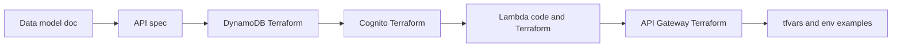

# Phase 1: Backend Foundation and Auth — Implementation Plan

## Decisions (locked in)


| Item                     | Choice                                 | Rationale                                         |
| ------------------------ | -------------------------------------- | ------------------------------------------------- |
| Region                   | `eu-north-1`                           | Per your preference                               |
| API spec location        | `[docs/api/](docs/api/)`               | Single place for API docs; no new package for MVP |
| Terraform location       | `[infra/terraform/](infra/terraform/)` | One root with separate `.tf` files per concern    |
| Cognito hosted UI domain | `grandline-player-auth`                | Unique, descriptive prefix for the player app     |


---

## 1. Data model and API spec

**1.1 Data model** — Add `[docs/data-model.md](docs/data-model.md)` describing:

- **Users:** Identity in Cognito; optional `users` table keyed by Cognito `sub` for display name/email if needed later. Phase 1 can rely on Cognito only; document the option.
- **Races:** Table with: `id` (PK), `name`, `checkpoints` (list of `{order, lat, lng}`), `amot` (allowed means of transport, e.g. `["run","bike"]`), `start_window` (ISO8601 or epoch), `invite_code` (unique, GSI for lookup), `paid` (boolean). Add `created_at` and optional `organizer_id` for future.

**1.2 API spec** — Add under `[docs/api/](docs/api/)`:

- **Auth:** Document that auth is via **Cognito** (sign up, sign in, session/refresh). No REST auth endpoints; mobile will use Cognito Hosted UI or SDK. Include User Pool id, App Client id, and (for Hosted UI) domain in env template.
- **Races (OpenAPI or Markdown):**
  - `GET /races?inviteCode={code}` — get race by invite code (for join flow). Returns 200 + race payload or 404. Protected by Cognito JWT.
  - `GET /races/{id}` — get race by id. Same response shape; Cognito JWT required.
- Response shape: id, name, checkpoints, amot, start_window, invite_code, paid (and any other fields from data model). Put this in `[docs/api/races.md](docs/api/races.md)` and optionally a minimal `[docs/api/openapi.yaml](docs/api/openapi.yaml)` for the races API.

---

## 2. Terraform layout and provider

**2.1 Directory layout**

```
infra/terraform/
  main.tf           # provider, backend (optional: s3 + dynamodb for state)
  variables.tf      # region, project_name, cognito_domain_prefix, etc.
  outputs.tf        # user_pool_id, client_id, api_base_url, etc.
  cognito.tf        # user pool, app client, hosted UI domain
  dynamodb.tf       # races table; optional users table
  lambda.tf         # Lambda (races API), IAM role, deployment package ref
  api_gateway.tf    # HTTP API or REST API, Cognito authorizer, routes -> Lambda
  terraform.tfvars.example
```

Single Terraform root; no nested modules for Phase 1.

**2.2 Provider and backend**

- `main.tf`: AWS provider with `region = var.region` (default `eu-north-1`). Optional: `backend "s3"` block commented with instructions so state can be moved to S3 later; local state for initial apply is fine.

---

## 3. Cognito

**3.1 Resources in `[infra/terraform/cognito.tf](infra/terraform/cognito.tf)**`

- **User pool:** Sign-in options = email (or username); password policy; no MFA for MVP; standard attributes (email, preferred_username). Unique prefix so multiple stacks don’t clash (e.g. `var.project_name`).
- **App client:** One public client for the mobile app (no secret): allowed OAuth flows = `USER_PASSWORD_AUTH` and/or `USER_SRP_AUTH` for SDK; or `code` for Hosted UI. Callback/sign-out URLs: placeholder (e.g. `https://localhost/callback`) — Phase 2 mobile will replace with app scheme. Read/write attributes for profile as needed.
- **Hosted UI domain:** `aws_cognito_user_pool_domain` with domain prefix = `grandline-player-auth` (or `var.cognito_domain_prefix`). Enables “Sign in with Hosted UI” if you use it later.

**3.2 Outputs**

- `cognito_user_pool_id`, `cognito_user_pool_endpoint`, `cognito_app_client_id`, `cognito_hosted_ui_domain` (if used). These feed into `terraform.tfvars.example` and `.env.example` for the app.

---

## 4. DynamoDB

**4.1 Tables in `[infra/terraform/dynamodb.tf](infra/terraform/dynamodb.tf)**`

- **Races table:**
  - PK: `id` (string).
  - GSI: `invite_code` as partition key (unique invite codes for lookup). Name GSI e.g. `by-invite-code`.
  - Billing: on-demand for MVP.
  - Point-in-time recovery optional; enable if you want.
- **Users table (optional for Phase 1):** If included: PK `id` (= Cognito `sub`). Attributes: `email`, `name`, `created_at`. Create only if you want a place to store profile from Cognito; otherwise omit and add in a later phase.

---

## 5. Lambda (races API)

**5.1 Runtime and packaging**

- Runtime: **Node.js 20.x** (aligns with monorepo and good AWS SDK support).
- Single Lambda function: **races** — handles both “get by invite code” and “get by id” via path/query (API Gateway mapping).
- Code: new package at `[infra/terraform/lambda/races/](infra/terraform/lambda/races/)` (or `[infra/lambda/races/](infra/lambda/races/)` if you prefer to keep Terraform and Lambda source siblings). Minimal handler: read `requestContext`/query/path, call DynamoDB (GetItem or Query on GSI), return JSON. No external dependencies for Phase 1 (use AWS SDK v3 bundled or built-in).

**5.2 IAM**

- Lambda execution role (basic Lambda + CloudWatch logs).
- Policy: `dynamodb:GetItem`, `dynamodb:Query` on the races table (and users table if present). Least privilege.

**5.3 Terraform**

- `lambda.tf`: `aws_lambda_function` pointing at a zip (e.g. built from `infra/lambda/races/` via `archive_file` + `npm install`/build in Terraform or a small script). Environment variables: table name(s), region.

---

## 6. API Gateway

**6.1 Type and authorizer**

- **HTTP API (apigatewayv2)** — simpler and cheaper for MVP; or REST API if you prefer. Plan uses **HTTP API**.
- **Cognito authorizer:** JWT authorizer with Cognito User Pool issuer and audience (app client id). Attach to routes that need auth (both race routes).

**6.2 Routes**

- `GET /races?inviteCode=...` → Lambda (query string passed).
- `GET /races/{id}` → Lambda (path parameter passed).
- CORS: allow origin for mobile (e.g. `*` for dev or your app scheme); tighten in Phase 6.

**6.3 Integration**

- Lambda integration with `payload_format_version = "2.0"` (HTTP API payload format). Grant API Gateway permission to invoke the Lambda.

---

## 7. Environment and tfvars templates

**7.1** `[infra/terraform/terraform.tfvars.example](infra/terraform/terraform.tfvars.example)`:

- `region = "eu-north-1"`
- `project_name = "grandline"`
- `cognito_domain_prefix = "grandline-player-auth"`
- Any other variables (e.g. stage name). No secrets; instructions in comments to copy to `terraform.tfvars` and fill if needed.

**7.2** `[.env.example](.env.example)` at repo root (for Phase 2 mobile):

- Placeholders: `EXPO_PUBLIC_API_BASE_URL=`, `EXPO_PUBLIC_COGNITO_USER_POOL_ID=`, `EXPO_PUBLIC_COGNITO_CLIENT_ID=`, `EXPO_PUBLIC_COGNITO_REGION=eu-north-1`, and optionally Hosted UI URL. Comment that values come from `terraform output` after apply.

---

## 8. Implementation order




1. **docs/data-model.md** — Races (and optional users) schema.
2. **docs/api/** — `races.md` + auth note; optional `openapi.yaml` for races.
3. **infra/terraform/variables.tf + outputs.tf** — variables and outputs used below.
4. **infra/terraform/dynamodb.tf** — Races table + GSI; users table optional.
5. **infra/terraform/cognito.tf** — User pool, app client, hosted UI domain.
6. **Lambda** — Create `infra/lambda/races/` (or under terraform) with handler; zip and reference in **infra/terraform/lambda.tf**.
7. **infra/terraform/api_gateway.tf** — HTTP API, Cognito authorizer, routes, CORS.
8. **infra/terraform/main.tf** — Provider (and optional backend comment).
9. **terraform.tfvars.example** and **.env.example** — With region `eu-north-1` and Cognito domain `grandline-player-auth`.

---

## 9. Post-apply checklist (for you)

- Run `terraform init` and `terraform apply` in `infra/terraform/` (with real `terraform.tfvars` or CLI vars).
- Create at least one test race item in DynamoDB (e.g. via AWS console or a one-off script) with an `invite_code` for Phase 3 join flow.
- Copy Terraform outputs into `.env` for the mobile app when starting Phase 2.
- Confirm Cognito sign-up/sign-in in the Hosted UI (or via SDK) and that `GET /races?inviteCode=...` and `GET /races/{id}` return the expected payload with a valid JWT.

---

## 10. Out of scope for Phase 1

- Organizer UI or race-creation API (Phase 7).
- Beta Pass / paid-race gating logic (Phase 6); data model supports `paid` flag only.
- Waiver on signup (Phase 6 / Concept).
- CI deployment of Terraform (can be added later); Phase 1 is manual apply.

