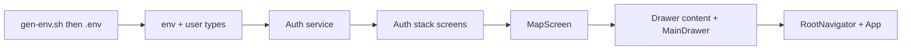

# Phase 2: Mobile App Shell and Map-First Home — Implementation Plan

## 0. Generate `.env` from Terraform outputs (reference, no hardcoding)

**Approach:** A small script runs `terraform output -raw` in [infra/terraform/](infra/terraform/) and writes [`.env`](.env) at repo root. No Terraform config changes; no hardcoded values. After any `terraform apply`, re-run the script to refresh `.env`.

**Artifact:** [scripts/gen-env.sh](scripts/gen-env.sh)

- Run from repo root: `./scripts/gen-env.sh`
- Script: `cd infra/terraform`, then for each output run `terraform output -raw <name>` and build the `EXPO_PUBLIC_*` vars. Write `.env` at repo root with same format as [.env.example](.env.example).
- Outputs to read (from [infra/terraform/outputs.tf](infra/terraform/outputs.tf)): `api_base_url`, `cognito_user_pool_id`, `cognito_app_client_id`, `cognito_hosted_ui_domain`. Region is fixed `eu-north-1` in script (or add a `region` output in Terraform later). Hosted UI URL = `https://${cognito_hosted_ui_domain}.auth.eu-north-1.amazoncognito.com`.
- Do not commit `.env` (it is in `.gitignore`).

**Why script instead of Terraform `local_file`:** No changes to Terraform state or apply behavior; script is optional and run only when you need to refresh app config. Least breaking.

---

## Prerequisites (from Phase 1)

- Backend and auth are in place: Cognito user pool, API Gateway, Lambda, DynamoDB ([infra/terraform/](infra/terraform/)), [docs/api/auth.md](docs/api/auth.md).
- Run `./scripts/gen-env.sh` so `.env` exists (generated from Terraform outputs); app reads it via `EXPO_PUBLIC_*`.

Current mobile app: Expo 52, React Native 0.76, minimal [apps/mobile/src/App.tsx](apps/mobile/src/App.tsx) (title only), [apps/mobile/src/config/assets.ts](apps/mobile/src/config/assets.ts). No navigation, map, or auth yet.

---

## Goal and scope (from [Grandline_Phases.md](Grandline_Phases.md))

**Goal:** Player can open the app, sign in, and see the map as home.

**Scope:** Auth integration, full-screen map (default view), north-up, pan/zoom, navigation drawer (hamburger) with placeholder menu items. No race-specific UI (Phase 3+).

**Reference:** [Grandline_Context.md](Grandline_Context.md) — "Core UX Principle", "Home Screen (Primary Screen)", "Navigation Drawer".

---

## 1. Dependencies

Add to [apps/mobile/package.json](apps/mobile/package.json) (use `npx expo install` where applicable for version compatibility):

| Package | Purpose |
|--------|---------|
| `@react-navigation/native`, `@react-navigation/native-stack`, `@react-navigation/drawer` | Root navigator, auth stack, drawer with map as home |
| `react-native-screens`, `react-native-safe-area-context` | Required by React Navigation |
| `react-native-maps` | Full-screen map (north-up, pan/zoom) |
| `amazon-cognito-identity-js` | Cognito SDK auth (sign in, sign up, session) without full Amplify |

**Note:** `react-native-maps` with Expo may require a development build (`expo prebuild` / `expo run:ios` or `expo run:android`) for native map support; Expo Go has limitations. Plan assumes dev build for device/simulator map testing.

---

## 2. Config and types

**2.1 API / env config** — [apps/mobile/src/config/env.ts](apps/mobile/src/config/env.ts)

- Read `process.env.EXPO_PUBLIC_API_BASE_URL`, `EXPO_PUBLIC_COGNITO_USER_POOL_ID`, `EXPO_PUBLIC_COGNITO_CLIENT_ID`, `EXPO_PUBLIC_COGNITO_REGION` (and optional Hosted UI URL).
- Export typed config object; fail gracefully or warn if missing so devs know `.env` is set (from Terraform outputs).

**2.2 User/session types** — [apps/mobile/src/types/user.ts](apps/mobile/src/types/user.ts)

- Types for session/user: e.g. `{ id: string, email?: string, name?: string }` aligned with Cognito (sub, email, preferred_username). Used by auth service and drawer placeholder.

---

## 3. Auth service

**3.1** [apps/mobile/src/services/auth.ts](apps/mobile/src/services/auth.ts)

- Initialize `CognitoUserPool` from env (User Pool id, Client id from `.env`).
- **getCurrentUser / getSession:** Return current CognitoUser and session (tokens) or null.
- **signIn(email, password):** Authenticate via `USER_PASSWORD_AUTH` or `USER_SRP_AUTH`; return session/user info.
- **signOut:** Global sign-out.
- **signUp(email, password, optional name):** Register user; document that confirmation (e.g. email) is handled by Cognito/Phase 1 config.
- Use `amazon-cognito-identity-js` only; no Amplify. Export a small interface so the app can subscribe to auth state (e.g. callback or simple getter used by navigator).

---

## 4. Navigation structure

**4.1 Root** — [apps/mobile/src/navigation/RootNavigator.tsx](apps/mobile/src/navigation/RootNavigator.tsx) (or equivalent)

- `NavigationContainer` as root.
- Auth gate: if no session → show auth stack; if session → show main app (drawer).
- Session can be checked on mount and after sign-in/sign-out (state in parent or context).

**4.2 Auth stack** — [apps/mobile/src/navigation/AuthStack.tsx](apps/mobile/src/navigation/AuthStack.tsx)

- Stack with Sign In and Sign Up screens (placeholder or simple forms calling auth service). No drawer here.

**4.3 Main (drawer)** — [apps/mobile/src/navigation/MainDrawer.tsx](apps/mobile/src/navigation/MainDrawer.tsx)

- Drawer navigator whose **default/first screen is the Map screen** (home).
- Other drawer items: placeholders for Profile, Active race, Leaderboard, Join race, Rules/Safety, Logout (per Context). Logout calls auth service and clears session so root switches back to auth stack.

**4.4 Screen registration**

- Map screen as home; optional placeholder screens for "Profile", "Join race", etc., so drawer items have a target (can be simple "Coming in Phase 3" text). This keeps the map as the only substantial screen for Phase 2.

---

## 5. Map screen

**5.1** [apps/mobile/src/screens/MapScreen.tsx](apps/mobile/src/screens/MapScreen.tsx)

- Full-screen `MapView` (react-native-maps).
- North-up, pan and zoom enabled; default region (e.g. Stockholm or eu-north-1-friendly coordinates) so the map loads with a sensible view.
- No race markers, no player marker yet (Phase 4); just the map as home per Phase 2 scope.
- Optional: header with hamburger that opens the drawer (if not auto-visible).

---

## 6. Navigation drawer component

**6.1** [apps/mobile/src/components/Drawer.tsx](apps/mobile/src/components/Drawer.tsx) (or `NavigationDrawer.tsx`)

- Custom drawer content component: list of placeholder items (Profile, Active race, Leaderboard, Join race, Rules/Safety, Logout).
- Logout: call auth service `signOut()`, then navigate/state update so root shows auth stack.
- Other items: navigate to placeholder screens or no-op for now. Match labels to Context.

---

## 7. App entry

**7.1** [apps/mobile/src/App.tsx](apps/mobile/src/App.tsx)

- Render `NavigationContainer` and root navigator (auth gate + AuthStack | MainDrawer).
- Auth state: hold in React state (or a small context) updated after sign-in/sign-out and on initial session check (auth.getSession() on mount).
- Ensure map is the default screen when authenticated (drawer's first screen = MapScreen).

---

## 8. Implementation order

1. **Add [scripts/gen-env.sh](scripts/gen-env.sh)** — Script that runs `terraform output -raw` in `infra/terraform` and writes `.env` at repo root. Run `./scripts/gen-env.sh` once (and after any `terraform apply`) to generate `.env`; no hardcoding.
2. **env.ts** and **user types** — Config and types used by auth and app.
3. **Auth service** — Cognito pool (using `.env`), getSession, signIn, signOut, signUp.
4. **Auth stack** — Sign-in and sign-up screens (simple forms) that call auth service and update app auth state.
5. **MapScreen** — Full-screen MapView, north-up, pan/zoom, default region.
6. **Drawer content** — Custom drawer menu (placeholders + Logout); wire to MainDrawer.
7. **MainDrawer** — Drawer navigator with Map as home and drawer content.
8. **RootNavigator** — Auth gate; AuthStack vs MainDrawer.
9. **App.tsx** — Root: NavigationContainer + RootNavigator; auth state from session check and auth callbacks.

---

## 9. Out of scope for Phase 2

- Race-specific UI (join race, checkpoints, HUD) — Phase 3+.
- Player location on map — Phase 4.
- Profile/Leaderboard/Join race real screens — Phase 3–6; placeholders only.
- Hosted UI callback (app scheme): Phase 1 Terraform has placeholder callback; document that Phase 2 uses SDK sign-in; Hosted UI + deep link can be added later if desired.

---

## 10. Post-implementation checklist

- Run `./scripts/gen-env.sh` so `.env` exists at repo root (generated from Terraform outputs).
- Run app with dev build if using `react-native-maps` (`expo run:ios` or `expo run:android`).
- Sign up / sign in via placeholder auth screens; confirm transition to map home and drawer opens with placeholder items; Logout returns to sign-in.
