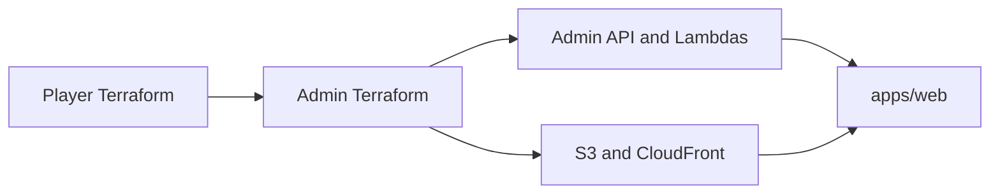

# Phase 3: Admin Webpage and Infrastructure — Execution Plan

**Source:** [phase_3_admin_webpage.plan.md](.cursor/plans/phase_3_admin_webpage.plan.md), [Grandline_Phases.md](Grandline_Phases.md) (Phase 3).

**Prerequisites (already in repo):** Player Terraform at [infra/terraform/](infra/terraform/) (Cognito pool, API Gateway, DynamoDB races table), races Lambda at [infra/lambda/races/](infra/lambda/races/), data model in [docs/data-model.md](docs/data-model.md).

---

## 1. Player Terraform (minimal changes)

- **Add admin group** in [infra/terraform/cognito.tf](infra/terraform/cognito.tf): `aws_cognito_user_pool_group` named `admin`.
- **Expose ARNs** in [infra/terraform/outputs.tf](infra/terraform/outputs.tf): add `cognito_user_pool_arn` (from `aws_cognito_user_pool.main.arn`) and `races_table_arn` (from `aws_dynamodb_table.races.arn`) so admin Terraform can reference them.
- **Optional — bootstrap admin user:** Add `aws_cognito_user` for `grandline.mvp@gmail.com` and `aws_cognito_user_in_group` for `admin`, using a sensitive variable (e.g. `admin_bootstrap_password`) and `lifecycle { ignore_changes = [password] }`. Document in README/runbook that password is set out-of-band only.

---

## 2. Admin infrastructure (`infra/terraform_admin/`)

Create new Terraform module that consumes **player outputs** as variables:

| File                       | Purpose                                                                                                                                                                                                                                                                                       |
| -------------------------- | --------------------------------------------------------------------------------------------------------------------------------------------------------------------------------------------------------------------------------------------------------------------------------------------- |
| `main.tf`                  | Provider, Terraform block, backend (optional).                                                                                                                                                                                                                                                |
| `variables.tf`             | `region`, `project_name`, `stage`, `cognito_user_pool_id`, `cognito_user_pool_arn`, `races_table_name`, `races_table_arn`, `admin_callback_url`.                                                                                                                                              |
| `outputs.tf`               | Admin API URL, CloudFront URL, admin Cognito app client id.                                                                                                                                                                                                                                   |
| `cognito.tf`               | New `aws_cognito_user_pool_client` for admin web (Hosted UI callback = admin origin).                                                                                                                                                                                                         |
| `api_gateway.tf`           | HTTP API, JWT authorizer (existing pool, audience = admin client id), routes: `GET/POST /admin/races`, `GET/PUT/DELETE /admin/races/{id}`, `GET/POST /admin/users`, `POST /admin/users/{username}/disable`, `DELETE /admin/users/{username}`.                                                 |
| `lambda.tf`                | Lambdas: **admin-races** (list/create/get/update/delete), **admin-users** (list/create/disable/delete). IAM: DynamoDB for races; Cognito ListUsers/AdminCreateUser/AdminDisableUser/AdminDeleteUser. Both Lambdas validate JWT and enforce `cognito:groups` contains `admin` (403 otherwise). |
| `hosting.tf`               | S3 bucket, CloudFront (OAC), default root and SPA error document.                                                                                                                                                                                                                             |
| `terraform.tfvars.example` | Example values; document that pool id/ARN and races table name/ARN come from player `terraform output`.                                                                                                                                                                                       |

---

## 3. Admin API Lambdas

- **Location:** [infra/lambda/admin-races/](infra/lambda/admin-races/) and [infra/lambda/admin-users/](infra/lambda/admin-users/) (or single `admin-api/` with path routing — plan allows either).
- **Shared:** Validate JWT and require `cognito:groups` to contain `admin`; return 403 otherwise. Same CORS/JSON style as [infra/lambda/races/index.js](infra/lambda/races/index.js).
- **admin-races:** List (Scan), create (PutItem, UUID, `created_at`), get, update, delete. Env: `RACES_TABLE_NAME`. Match race schema from [docs/data-model.md](docs/data-model.md).
- **admin-users:** ListUsers, AdminCreateUser, AdminDisableUser, AdminDeleteUser. Env: `COGNITO_USER_POOL_ID`.

---

## 4. Admin Webpage (`apps/web/`)

- **Stack:** React + TypeScript + Vite.
- **Auth:** Hosted UI or Amplify with **admin** Cognito app client; send Bearer JWT to admin API. On 403, show "Admin required" or redirect.
- **Config:** [apps/web/.env.example](apps/web/.env.example): `VITE_ADMIN_API_URL`, `VITE_COGNITO_USER_POOL_ID`, `VITE_COGNITO_CLIENT_ID`, `VITE_COGNITO_REGION`.
- **Pages:** Users (list, add, disable/delete), Races (list, create, edit, delete). Layout: top nav or sidebar (Users, Races, Logout).

---

## 5. Docs and CI

- **Docs:** Add [docs/api/admin.md](docs/api/admin.md) (or extend OpenAPI) for admin endpoints and auth. Document that admin Terraform requires player outputs as variables and bootstrap admin email (password set out-of-band).
- **CI:** Optional GitHub Action to build `apps/web` and deploy to S3 + invalidate CloudFront.

---

## 6. Deployment order (runbook)

1. Apply **player** Terraform (admin group, optional bootstrap user, new outputs).
2. Create **admin** Terraform vars from player outputs (pool id/ARN, races table name/ARN, admin callback URL).
3. Apply **admin** Terraform (hosting, API, Lambdas, admin app client).
4. If placeholder callback was used, update admin app client callback URLs.
5. Build and upload `apps/web` to S3; test login with bootstrap admin and CRUD for users and races.

---

## Dependency overview

All artifacts and file paths above match the existing [phase_3_admin_webpage.plan.md](.cursor/plans/phase_3_admin_webpage.plan.md). No open scope questions; execution can proceed in the order above once you confirm.