# Grandline — Development Phases

This document outlines the development phases for Grandline. It references:

- **[Grandline_Concept.md](Grandline_Concept.md)** — Full product vision: teams, races, serverless backend, payments, waiver, and legal/safety.
- **[Grandline_Context.md](Grandline_Context.md)** — MVP mobile player app spec: map-first UX, HUD, bottom sheet, drawer, leaderboard, and join flow.

The phases proceed from foundation and tooling, through backend and auth, to the mobile app shell and map-first home, then the Admin Webpage and its infrastructure, then the full race experience (join, pre-race, in-race, post-race, leaderboard), polish and MVP closure, and finally beyond-MVP features aligned with the Concept.

---

## Assumed directory layout

All artifact locations in this document are relative to the project root.

| Path                                                                  | Purpose                                                                                           |
| --------------------------------------------------------------------- | ------------------------------------------------------------------------------------------------- |
| `Grandline_Concept.md`, `Grandline_Context.md`, `Grandline_Phases.md` | Project root — concept, context, and this phase plan                                              |
| `apps/mobile/`                                                        | Player app (e.g. React Native); `apps/mobile/src/` — source; `apps/mobile/assets/` — images/icons |
| `apps/web/`                                                           | Admin Webpage — user management, race CRUD, expandable                                            |
| `infra/`                                                              | Terraform / backend-as-code                                                                       |
| `infra/terraform_admin/`                                              | Admin app infrastructure (hosting, API, auth); separate from player API in `infra/terraform/`      |
| `packages/`                                                           | Shared types or API spec (optional)                                                               |

---

## Phase 0: Foundation and Tooling

**Goal:** Repo and tooling ready for backend and mobile.

**Scope:** Monorepo layout (`apps/mobile`, `infra/`, optional `packages/`), shared types/config, lint/format, CI skeleton. Centralized asset config: `apps/mobile/src/config/assets.ts` with paths for markers and icons and safe fallbacks.

**Reference:** Context — “Asset References (Mobile Frontend)”, asset paths.

### Assets and artifacts to create at the beginning of Phase 0

| Artifact                                                   | Location                                                   |
| ---------------------------------------------------------- | ---------------------------------------------------------- |
| Monorepo root config (package.json, workspace definition)  | `/` (project root)                                         |
| Mobile app scaffold (entry, minimal app shell)             | `apps/mobile/`                                             |
| Asset directory structure (empty placeholder dirs)         | `apps/mobile/assets/markers/`, `apps/mobile/assets/icons/` |
| Centralized asset config with path constants and fallbacks | `apps/mobile/src/config/assets.ts`                         |
| Infra scaffold (directory for Terraform)                   | `infra/`                                                   |
| Lint/format config (e.g. ESLint, Prettier)                 | `/` or `apps/mobile/`                                      |
| CI workflow skeleton (e.g. GitHub Actions)                 | `.github/workflows/` (or equivalent)                       |

---

## Phase 1: Backend Foundation and Auth

**Goal:** Auth and core data available for the player app.

**Scope:** AWS (Terraform): Cognito user pool, API Gateway, Lambda, DynamoDB. Auth flows (sign up, sign in, session). Core data model: users, races (name, checkpoints, AMOT, start window, invite code, paid flag). No organizer UI yet.

**Reference:** Concept — “Technology Stack”, “User Interaction”; Context — Join race (invite code), Beta Pass gating.

### Assets and artifacts to create at the beginning of Phase 1

| Artifact                                                                    | Location                                   |
| --------------------------------------------------------------------------- | ------------------------------------------ |
| API spec (OpenAPI or markdown) for auth + races (invite code, get race)     | `docs/api/` or `packages/api-spec/`        |
| Terraform module layout (e.g. cognito, api-gateway, dynamodb, lambda)       | `infra/terraform/` (or `infra/modules/`)   |
| Environment / tfvars template (e.g. .env.example, terraform.tfvars.example) | `infra/` or `/`                            |
| DynamoDB table definitions (as Terraform or doc)                            | `infra/terraform/` or `docs/data-model.md` |
| Cognito user pool and app client config (Terraform)                         | `infra/terraform/cognito/` (or equivalent) |

---

## Phase 2: Mobile App Shell and Map-First Home

**Goal:** Player can open the app, sign in, and see the map as home.

**Scope:** Mobile app (React Native or chosen stack), auth integration, full-screen map (default view), north-up, pan/zoom. Navigation drawer (hamburger) with placeholder items. No race-specific UI yet.

**Reference:** Context — “Core UX Principle”, “Home Screen (Primary Screen)”, “Navigation Drawer”.

### Assets and artifacts to create at the beginning of Phase 2

| Artifact                                                          | Location                                                                       |
| ----------------------------------------------------------------- | ------------------------------------------------------------------------------ |
| App entry and root navigator (e.g. App.tsx, navigation container) | `apps/mobile/src/App.tsx`, `apps/mobile/src/navigation/`                       |
| Auth service module (sign in, sign up, session, token)            | `apps/mobile/src/services/auth.ts` (or `auth/`)                                |
| Map screen (full-screen map, north-up, pan/zoom)                  | `apps/mobile/src/screens/MapScreen.tsx`                                        |
| Navigation drawer component (hamburger, placeholder menu items)   | `apps/mobile/src/components/Drawer.tsx` (or `components/NavigationDrawer.tsx`) |
| API/base URL config (e.g. env.ts or .env)                         | `apps/mobile/src/config/env.ts` (or `.env.example`)                            |
| Shared types for user/session (if not in packages)                | `apps/mobile/src/types/user.ts` (or `packages/shared/src/`)                    |

---

## Phase 3: Admin Webpage and Infrastructure

**Goal:** Provide an admin web app to manage users and races, with dedicated infrastructure.

**Scope:** Admin Webpage at **`apps/web/`**: add/remove users (e.g. Cognito user management), create and manage races (CRUD), expandable later (e.g. race participants, settings). Admin infrastructure in **`infra/terraform_admin/`**: Terraform for admin-only resources — e.g. admin API (or routes), admin auth (Cognito group or separate pool), hosting for the web app (e.g. S3 + CloudFront). Keep the folder organized by concern (e.g. `cognito.tf`, `api_gateway.tf`, `hosting.tf`).

**Reference:** Concept — “Race Setup”, “User Interaction”; data model in `docs/data-model.md`, races API in `docs/api/races.md`.

### Assets and artifacts to create at the beginning of Phase 3

| Artifact                                                       | Location                 |
| -------------------------------------------------------------- | ------------------------ |
| Admin Webpage app (user management, race CRUD, expandable)     | `apps/web/`              |
| Admin infra (Terraform: hosting, admin API, admin auth)       | `infra/terraform_admin/` |

---

## Phase 4: Join Race and Pre-Race Experience

**Goal:** Player can join a race via invite code and see pre-race state on the map.

**Scope:** Join flow from drawer: invite code input, validation, API integration. Race stored locally/state. Pre-race bottom sheet: race description, allowed mode (Run/Bike icons), start window countdown, “Start Race” CTA. Map shows checkpoints and finish (if applicable) with placeholder or real positions. Top overlay: race name, elapsed time (0), checkpoint progress (e.g. 0/5).

**Reference:** Context — “Join Race Flow”, “Bottom Sheet (Pre-Race)”, “Top Overlay”, “Map Elements (Checkpoints, Finish)”, asset paths for markers/icons.

### Assets and artifacts to create at the beginning of Phase 4

| Artifact                                                             | Location                                                                     |
| -------------------------------------------------------------------- | ---------------------------------------------------------------------------- |
| Join Race screen (invite code input, validation UI)                  | `apps/mobile/src/screens/JoinRaceScreen.tsx`                                 |
| Races API client (fetch by invite code, get race details)            | `apps/mobile/src/api/races.ts` (or `services/races.ts`)                      |
| Bottom sheet component (collapsible container)                       | `apps/mobile/src/components/BottomSheet.tsx`                                 |
| Pre-race sheet content component (description, mode, countdown, CTA) | `apps/mobile/src/components/bottom-sheet/PreRaceContent.tsx` (or equivalent) |
| Checkpoint marker asset (image)                                      | `apps/mobile/assets/markers/checkpoint_marker.png`                           |
| Finish marker asset (image)                                          | `apps/mobile/assets/markers/finish_marker.png`                               |
| Run and Bike icons                                                   | `apps/mobile/assets/icons/run.svg`, `apps/mobile/assets/icons/bike.svg`      |
| Race and checkpoint types (for app state)                            | `apps/mobile/src/types/race.ts`                                              |

---

## Phase 5: In-Race Experience and Checkpoint Detection

**Goal:** Full in-race loop: GPS, checkpoint detection, HUD, and bottom sheet.

**Scope:** GPS polling, player marker on map (`user_marker.png`), map auto-center on start and soft re-center when user drifts. Checkpoint detection (geofence or distance), state updates (current target emphasized, completed dimmed). Top overlay: live elapsed time, checkpoint progress (e.g. 2/5). Bottom sheet: distance to next checkpoint, last checkpoint confirmation, “Center Map” CTA. Finish marker only when last checkpoint active.

**Reference:** Context — “Map Behavior”, “Map Elements”, “Top Overlay”, “Bottom Sheet (In-Race)”, “MVP UX Non-Goals” (no other players, no trails in v0).

### Assets and artifacts to create at the beginning of Phase 5

| Artifact                                                                                 | Location                                                        |
| ---------------------------------------------------------------------------------------- | --------------------------------------------------------------- |
| Player marker image                                                                      | `apps/mobile/assets/markers/user_marker.png`                    |
| Location service (GPS polling, permissions)                                              | `apps/mobile/src/services/location.ts`                          |
| Checkpoint detection logic (geofence or distance)                                        | `apps/mobile/src/services/checkpointDetection.ts` (or `utils/`) |
| Race state store or machine (in-race state, current checkpoint, elapsed time)            | `apps/mobile/src/state/race.ts` (or context/store)              |
| Top HUD overlay component (race name, elapsed time, checkpoint progress)                 | `apps/mobile/src/components/RaceHUD.tsx`                        |
| In-race bottom sheet content (distance to next, last checkpoint message, Center Map CTA) | `apps/mobile/src/components/bottom-sheet/InRaceContent.tsx`     |

---

## Phase 6: Post-Race and Leaderboard

**Goal:** Race end state and leaderboard.

**Scope:** Post-race bottom sheet: finish time, placement, “View Leaderboard” CTA. Leaderboard screen (separate): ordered list, status per participant (Finished with time, In progress, DNF), highlight current user. Names only (no avatars per Context).

**Reference:** Context — “Bottom Sheet (Post-Race)”, “Leaderboard Screen”.

### Assets and artifacts to create at the beginning of Phase 6

| Artifact                                                                      | Location                                                            |
| ----------------------------------------------------------------------------- | ------------------------------------------------------------------- |
| Leaderboard screen (list, status, highlight current user)                     | `apps/mobile/src/screens/LeaderboardScreen.tsx`                     |
| Leaderboard API client (fetch results by race)                                | `apps/mobile/src/api/leaderboard.ts` (or `services/leaderboard.ts`) |
| Post-race bottom sheet content (finish time, placement, View Leaderboard CTA) | `apps/mobile/src/components/bottom-sheet/PostRaceContent.tsx`       |
| Participant/result types (name, status, time, DNF)                            | `apps/mobile/src/types/leaderboard.ts` (or extend `types/race.ts`)  |
| Trophy icon (Context)                                                         | `apps/mobile/assets/icons/trophy.svg`                               |

---

## Phase 7: Polish, Safety, and MVP Closure

**Goal:** Ship-ready MVP player experience.

**Scope:** Drawer content: Profile (name, email), active race, leaderboard, join race, Rules/Safety, Logout. Beta Pass gating for paid races (Context). Asset pipeline: all markers and icons in place with fallbacks. Visual style: high contrast, large touch targets, minimal clutter. Optional: waiver on signup (Concept).

**Reference:** Context — “Navigation Drawer”, “Join Race Flow” (paid race gating), “Visual Style”, “Asset References”; Concept — “Legal and Safety”.

### Assets and artifacts to create at the beginning of Phase 7

| Artifact                                                                     | Location                                                                                                 |
| ---------------------------------------------------------------------------- | -------------------------------------------------------------------------------------------------------- |
| Profile screen or drawer profile section (name, email)                       | `apps/mobile/src/screens/ProfileScreen.tsx` or drawer content in `apps/mobile/src/components/Drawer.tsx` |
| Rules / Safety screen                                                        | `apps/mobile/src/screens/RulesScreen.tsx` (or `SafetyScreen.tsx`)                                        |
| Beta Pass gating utility (check pass, block join for paid race)              | `apps/mobile/src/utils/betaPass.ts` (or `services/betaPass.ts`)                                          |
| Waiver screen or flow (if implementing Concept waiver)                       | `apps/mobile/src/screens/WaiverScreen.tsx`                                                               |
| Invite icon (Context)                                                        | `apps/mobile/assets/icons/invite.svg`                                                                    |
| Copy/text assets for Rules, Safety, waiver                                   | `apps/mobile/src/config/copy.ts` or `assets/copy/` (as needed)                                           |
| Final asset checklist: all markers + icons present; fallbacks in `assets.ts` | `apps/mobile/assets/`, `apps/mobile/src/config/assets.ts`                                                |

---

## Phase 8: Beyond MVP (Concept Alignment)

**Goal:** Move toward full product vision.

**Scope:** Teams (create/join team, captain); live opponent positions and/or persistent trails (Concept); payments (entry fees, prize pool); deeper social (friends, chat). Enhancements to Admin Webpage (e.g. teams, payments) as needed. Order and scope can be refined later.

**Reference:** Concept — “Race Setup”, “Team Dynamics”, “Financial Transactions”, “User Interaction”.

### Assets and artifacts to create at the beginning of Phase 8

| Artifact                                                   | Location                                                        |
| ---------------------------------------------------------- | --------------------------------------------------------------- |
| Team data model and API spec (teams, captain, members)     | `docs/api/teams.md` or `packages/api-spec/`, `infra/terraform/` |
| Payment integration spec or spike (entry fees, prize pool) | `docs/payments.md` or `infra/`                                  |
| Feature flags or roadmap doc for post-MVP features         | `docs/roadmap.md` or repo config                                |
| Enhancements to Admin Webpage (e.g. teams, payments)      | `apps/web/`, `infra/terraform_admin/` as needed                |

---

## Phase dependency

```mermaid
flowchart LR
  P0[Phase_0_Foundation] --> P1[Phase_1_Backend_Auth]
  P1 --> P2[Phase_2_App_Shell_Map]
  P2 --> P3[Phase_3_Admin_Webpage]
  P3 --> P4[Phase_4_Join_PreRace]
  P4 --> P5[Phase_5_InRace]
  P5 --> P6[Phase_6_PostRace_Leaderboard]
  P6 --> P7[Phase_7_Polish_MVP]
  P7 --> P8[Phase_8_Beyond_MVP]
```

