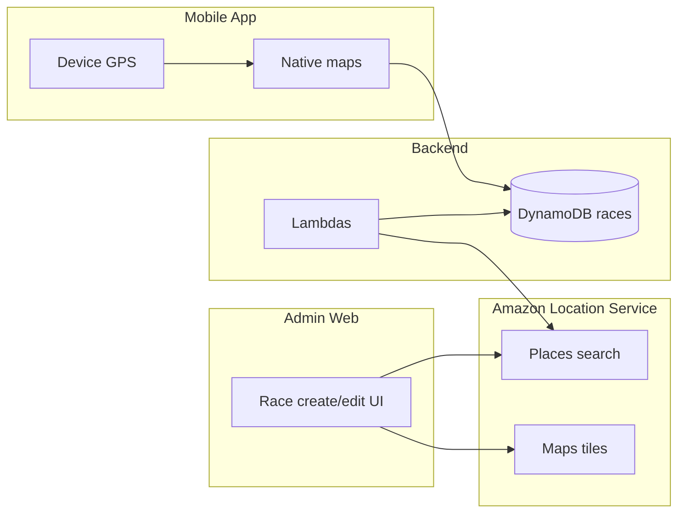

# Maps and location — hybrid strategy

Maps and location use a **hybrid approach**: Amazon Location Service for the backend and admin web; native maps (Apple MapKit / Google Maps) on mobile for display and device GPS.

---

## What we're doing (the capability)

| Layer | Approach |
| ----- | -------- |
| **Backend** | Use **Amazon Location Service** for geocoding, search, and (later) routing or geofencing. Lambdas and APIs call AWS instead of third-party map providers. |
| **Admin web** | Use **Amazon Location** (map tiles and a JS SDK or MapLibre) on the admin site so organisers can **place and edit race checkpoints on a map** when creating or editing races. Today checkpoints are just lat/lng in forms (see [RaceEditPage.tsx](../apps/web/src/pages/RaceEditPage.tsx)); a map would make race creation much easier (search places, click to add checkpoints, reorder). |
| **Mobile** | **No change.** Keep **react-native-maps** (Apple MapKit on iOS, Google Maps on Android) for display and device GPS. No Amazon SDK on the device. |

---

## Why we're doing it

- **Single vendor for backend and admin:** AWS for maps and location (billing, IAM, and networking stay in one place).
- **Better admin UX:** Organisers get a real map to draw races (search, click to add checkpoints, reorder) instead of typing coordinates.
- **Mobile stays simple:** No new dependencies; native maps and GPS remain fast and familiar.
- **Future use:** Same AWS service can support routing or geofencing later without adding another provider.

---

## Pros and cons

| | |
| --- | --- |
| **+** | One AWS-integrated stack for server-side and admin; no Google or Apple API keys for backend or admin web. |
| **+** | Admin gets a proper map UX for creating and editing races. |
| **+** | Mobile unchanged; no new SDKs or keys on the device. |
| **+** | Path to routing and geofencing later using the same service. |
| **-** | Amazon Location is less ubiquitous than Google Maps (fewer examples and community docs). |
| **-** | Admin web needs integration work (map component, search, checkpoint UI). |
| **-** | Two map stacks to document and maintain: Amazon for web/backend, native for mobile. |

---

## Likely how (implementation outline)

- **Backend:** Add Amazon Location (e.g. Places, Maps) in Terraform; grant Lambdas IAM and optional env (e.g. map resource names); add endpoints or internal calls for geocoding/search when needed.
- **Admin web:** Add a map to race create/edit (e.g. MapLibre or Amazon’s web map example) using Amazon Location map tiles and optional Places for search; persist checkpoints as today: `{ order, lat, lng }` per [data-model.md](data-model.md).
- **Mobile:** No code changes; keep using [location.ts](../apps/mobile/src/services/location.ts) and [MapScreen](../apps/mobile/src/screens/MapScreen.tsx) with existing race/checkpoint payloads from the API.

This doc is a high-level outline, not a step-by-step runbook.

---

## References

- [Amazon Location Service](https://docs.aws.amazon.com/location/) — Maps, Places, and (optionally) Routes.
- [Grandline data model](data-model.md) — Race and checkpoint schema.
- [Admin API](api/admin.md) — Admin races API (create/update races and checkpoints).
